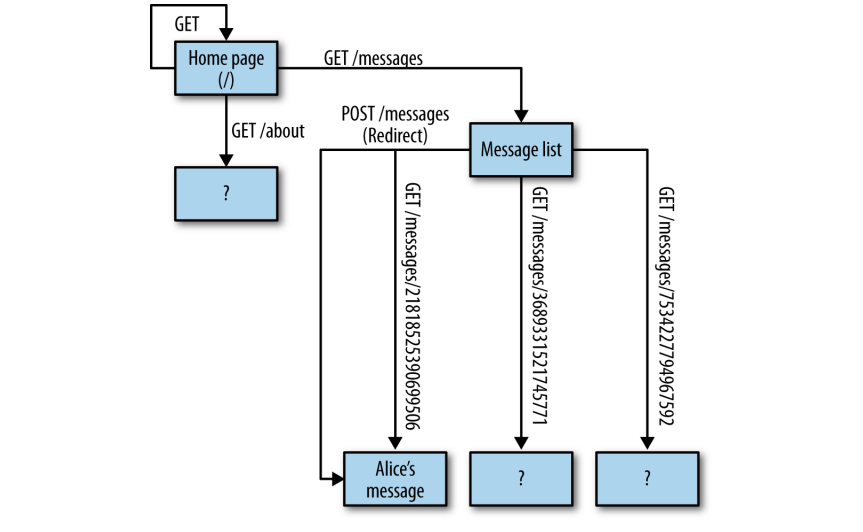

Debido a que las sesiones HTTP son tan cortas, el servidor no sabe nada sobre el estado de la aplicación de un cliente. El cliente no tiene control directo sobre el estado de los recursos en el servidor. Y, sin embargo, la Web funciona. Funciona a través de REST-transferencia de estado.

El estado de la aplicación se guarda en el cliente, pero el servidor puede manipularlo enviando representaciones--documentos HTML, en este caso--documentos HTML que describen las posibles transiciones de estado. El estado de los recursos se guarda en el servidor, pero el cliente puede manipularlo enviándole una representación--un formulario HTML, en este caso--que describe las posibles transiciones de estado.

## Conexión

En la historia, Alice hizo cuatro peticiones HTTP a YouTypeItWePostIt.com y obtuvo tres documentos HTML a cambio. Aunque Alice no siguió todos y cada uno de los enlaces en esos documentos, podemos usarlos para construir un mapa aproximado del sitio web desde la perspectiva del cliente (Figura 1-9).

*Figura 1-9. Lo que vio el cliente*

Se trata de una red de páginas HTML. Las hebras de la web son las etiquetas HTML `<a>` y `<form>`, cada una describiendo una petición GET o POST HTTP que Alice podría decidir hacer. Yo lo llamo principio de *conectividad*: cada página web te dice cómo llegar a las páginas contiguas.
